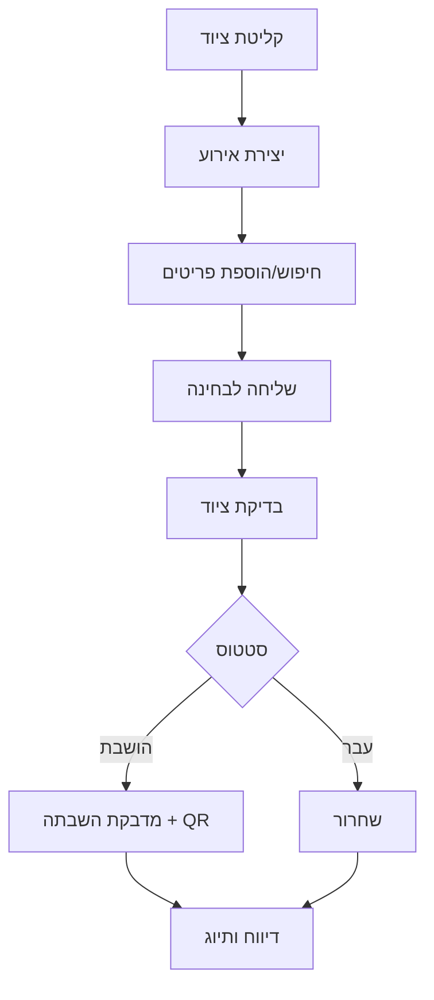
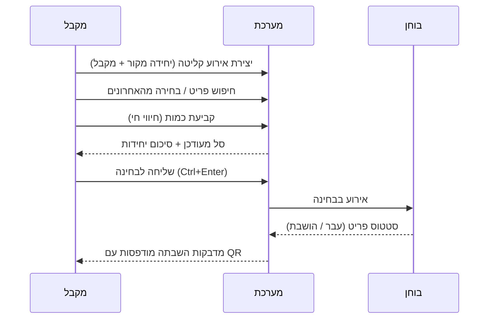

# סדר פעילות BAZAP 2.0 (עם תמונות/תרשימים)

מדריך קצר בגרסה ידידותית למפקדה וצוות השטח. כולל תרשימי זרימה (Mermaid) שמוצגים אוטומטית בגיטהאב.

## מפת על – מה קורה במערכת

## זרימת קליטה (שלב-אחר-שלב)

## מדריך מהיר במילים פשוטות
- **צור אירוע**: מסך קליטה → הזן יחידה מקור ושם מקבל → ״צור אירוע״.
- **הוסף פריטים**: חפש במק״ט/שם או לחץ על "פריטים אחרונים". לחיצה מוסיפה, לחיצה ארוכה / Quick Add לבחירת כמות.
- **עדכון כמות**: בסל השתמש ב-`+`/`-` או כתוב ידנית. כמות `0` מוחקת.
- **שליחה לבחינה**: כפתור ״שלח לבחינה״ או Ctrl+Enter. מוצג סיכום פריטים ויחידות.
- **בדיקה**: הבוחן קובע סטטוס. פריטים שנכשלו מקבלים **מדבקת השבתה מודרנית עם QR**.
- **מעקב מפקדה**: לוח מפקדה (Dashboard) מציג KPIs בזמן אמת, פעילות אחרונה וקצב מעבר.

## טיפי שימוש וקיצורי דרך
- `?` או `H`: פותח עזרה מהירה.
- `F` או `/`: קופץ לשורת החיפוש.
- `Esc`: סוגר חלונות/עוצר חיפוש.
- `Ctrl + Enter`: שליחה לבחינה מידית.
- פלוס/מינוס בסל: עדכון כמות מהיר.

## מיפוי מסכים
- **מפקדה**: KPIs, פעילות אחרונה, קצב מעבר/השבתה.
- **קליטה**: חיפוש חכם, סל פריטים, קיצורי מקלדת.
- **בחינה**: סטטוס פריטים, הפקת מדבקות.
- **היסטוריה**: צפייה בדו"חות ובאירועים אחרונים.
- **ניהול פריטים**: עריכה ותחזוקה של מאגר הפריטים.

> התרשימים כאן הם "תמונות חיות" – מוצגים אוטומטית בגיטהאב וניתנים לעדכון בקלות.
